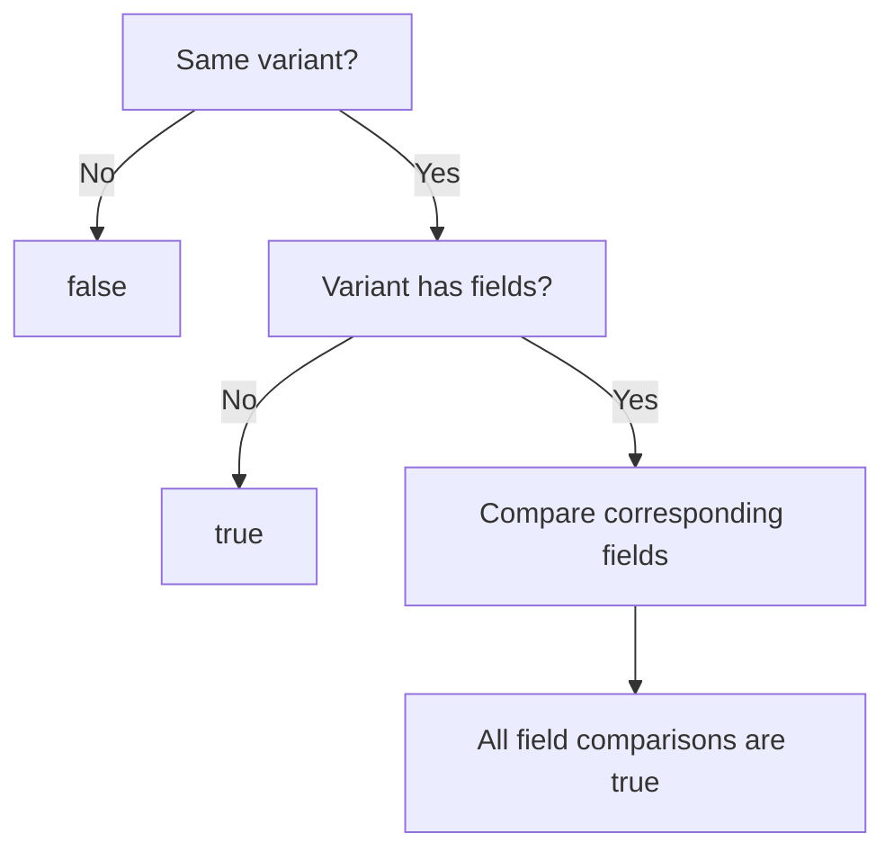
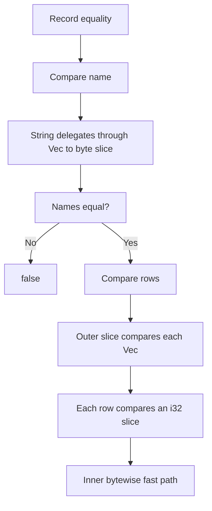

# `PartialEq` and `#[derive(PartialEq)]`: From Field Comparisons to Bytewise Equality

`PartialEq` powers Rust's `==` and `!=` operators. A comparison can involve several mechanisms: a derived implementation compares a type's immediate fields, those fields use their own implementations, and selected standard-library implementations use specialization to compare whole memory regions.

This article traces how equality comparisons proceed from a derived struct through the standard library to the bytewise fast paths used by slices and arrays.

## 1. The equality contract

For an overloaded comparison, the expression:

```rust
a == b
```

can be understood as:

```rust
PartialEq::eq(&a, &b)
```

The operator implicitly borrows its operands. Comparing two owned values does not, by itself, move them. Primitive comparisons have built-in compiler support, which we will return to in Section 3.

The essential interface is:

```rust
pub trait PartialEq<Rhs: ?Sized = Self> {
    fn eq(&self, other: &Rhs) -> bool;

    fn ne(&self, other: &Rhs) -> bool {
        !self.eq(other)
    }
}
```

`Rhs` defaults to `Self`, but a type can also implement comparisons with other types. For example, comparing `String` with `str` uses a different implementation from comparing `String` with `String`.

The methods must agree: `a != b` must have the same result as `!(a == b)`. The default `ne` provides this consistency.

Equality must also be symmetric and transitive whenever the necessary implementations exist:

| Property | Requirement | Implementations needed |
| --- | --- | --- |
| Symmetry | If `a == b`, then `b == a` | `A: PartialEq<B>` and `B: PartialEq<A>` |
| Transitivity | If `a == b` and `b == c`, then `a == c` | `A: PartialEq<B>`, `B: PartialEq<C>`, and `A: PartialEq<C>` |

Rust does not require those reverse or transitive comparison implementations to exist. The laws apply when they do exist. The compiler checks that implementations are well-typed; it does not prove these semantic laws. Violating them is a logic error, and unsafe code must not rely on their correctness for memory safety. See the [`PartialEq` contract](https://doc.rust-lang.org/std/cmp/trait.PartialEq.html).

`Eq` adds reflexivity: every value must compare equal to itself. Its essential interface is simply:

```rust
pub trait Eq: PartialEq {}
```

It adds no comparison algorithm. Floating-point types illustrate the distinction: a NaN does not compare equal to itself, so floating-point types implement `PartialEq` but not `Eq`.

Deriving `Eq` checks the required field bounds, but it still does not prove that the implementations obey the laws. The actual comparison remains the one supplied by `PartialEq`. See the [`Eq` documentation](https://doc.rust-lang.org/std/cmp/trait.Eq.html).

## 2. What derive generates

You can write an implementation directly:

```rust
struct Point {
    x: i32,
    y: i32,
}

impl PartialEq for Point {
    fn eq(&self, other: &Self) -> bool {
        self.x == other.x && self.y == other.y
    }
}
```

Or let the built-in derive macro generate the comparison:

```rust
#[derive(PartialEq)]
struct Point {
    x: i32,
    y: i32,
}
```

For this struct, the generated `eq` has the same field-comparison behavior as the handwritten version. The derived implementation uses the trait's default `ne`.

The central rule is:

> **Derive generates the comparison structure for the annotated type. Each immediate field is compared through that field type's own `PartialEq` implementation.**

For example:

```rust
#[derive(PartialEq)]
struct Inner {
    value: i32,
}

#[derive(PartialEq)]
struct Outer {
    inner: Inner,
    enabled: bool,
}
```

The relevant comparison for `Outer` is equivalent to:

```rust
impl PartialEq for Outer {
    fn eq(&self, other: &Self) -> bool {
        self.inner == other.inner && self.enabled == other.enabled
    }
}
```

Deriving `Outer` does not paste the body of `Inner::eq` into this method. `Inner` must already have a usable `PartialEq` implementation, whether derived or handwritten.

For generic types, derive also generates bounds. A basic example is:

```rust
#[derive(PartialEq)]
struct Wrapper<T> {
    value: T,
}
```

Here, the derived implementation requires `T: PartialEq`. For more complex field types, however, derive may impose stricter bounds than necessary. A handwritten implementation could sometimes use less restrictive bounds while performing the comparisons.

Generated implementations carry `#[automatically_derived]`, which lets tools and diagnostics recognize them. See the [Reference's description of derive](https://doc.rust-lang.org/reference/attributes/derive.html).

This discussion is only about how `==` compares two values. Constants used as patterns have an additional restriction: for structs and enums, `PartialEq` must be derived. A type with a handwritten `PartialEq` implementation is rejected as a constant pattern, even if its eq behaves exactly like the derived implementation, because constant patterns require structural equality rather than an arbitrary user-defined comparison.

See [constant patterns](https://doc.rust-lang.org/reference/patterns.html#constant-patterns).

## 3. Primitive values, enums, and references

### 3.1 Where primitive comparisons end

Consider:

```rust
let a: i32 = 1;
let b: i32 = 2;
let equal = a == b;
```

The compiler has a primitive integer comparison operation. It does not need to implement this operation by recursively calling the same trait method.

Nevertheless, `core` supplies `PartialEq` implementations for primitive types so that they also participate in trait-based and generic code. The integer implementation is essentially:

```rust
impl PartialEq for i32 {
    fn eq(&self, other: &Self) -> bool {
        *self == *other
    }
}
```

Inside this implementation, both operands are known to be integers. The `==` expression reaches the compiler's primitive comparison rather than calling back into the same method.

Thus `i32` provides both built-in equality and a trait interface to that equality. Generic code can require `T: PartialEq`, instantiate `T` with `i32`, and ultimately reach the primitive operation. The source-level method boundaries do not imply that the final machine code contains corresponding function calls. See the [primitive implementations in `core::cmp`](https://doc.rust-lang.org/nightly/src/core/cmp.rs.html).

### 3.2 Enum comparisons

For an enum, equality requires the same variant and equal fields within that variant:

```rust
#[derive(PartialEq)]
enum Shape {
    Circle(i32),
    Point,
}
```

A portable handwritten implementation with the same comparison behavior is:

```rust
impl PartialEq for Shape {
    fn eq(&self, other: &Self) -> bool {
        match (self, other) {
            (Shape::Circle(a), Shape::Circle(b)) => a == b,
            (Shape::Point, Shape::Point) => true,
            _ => false,
        }
    }
}
```

This implementation is an alternative to the derive above, not an additional implementation to place beside it.

The same logic can be organized as a discriminant check followed by payload comparisons. In that organization, different discriminants immediately produce `false`. Once equal discriminants have established that both values have the same variant, fieldless variants need no further comparison.

That explains why a generated body with a preceding discriminant check can use a final `_ => true` arm. Without that preceding check, the same wildcard would incorrectly accept different variants.



The diagram describes equality semantics. It does not require the compiler to emit a particular match expression or a separate physical discriminant load for every enum representation.

### 3.3 Why reference bindings compare the underlying values

In the `Circle` match arm, `a` and `b` are references to the payloads. Their comparison uses the standard library's forwarding implementation for references, conceptually:

```rust
impl<A: ?Sized, B: ?Sized> PartialEq<&B> for &A
where
    A: PartialEq<B>,
{
    fn eq(&self, other: &&B) -> bool {
        PartialEq::eq(*self, *other)
    }
}
```

Here `Self` is `&A`, so the method receives `&&A`. Dereferencing that argument once produces the `&A` required by the underlying comparison.

For the enum example, reference equality therefore reaches `i32` equality. Comparing references in this way compares the referenced values according to their `PartialEq` implementation; it does not test whether the references point to the same allocation. The standard library provides corresponding mutable-reference combinations as well. See the [reference implementations in `core::cmp`](https://doc.rust-lang.org/nightly/src/core/cmp.rs.html).

## 4. Slice equality and specialization

When a field comparison reaches a slice, derive has no slice algorithm to generate. The standard-library implementation handles it.

### 4.1 Check lengths, then delegate

The slice implementation is structured as follows:

```rust
impl<T, U> PartialEq<[U]> for [T]
where
    T: PartialEq<U>,
{
    fn eq(&self, other: &[U]) -> bool {
        let len = self.len();

        if len != other.len() {
            return false;
        }

        // SAFETY: Both pointers come from valid slices,
        // and both slices contain `len` elements.
        unsafe {
            SlicePartialEq::equal_same_length(
                self.as_ptr(),
                other.as_ptr(),
                len,
            )
        }
    }
}
```

`T: PartialEq<U>` permits the comparison even when the element types differ. Once the lengths match, the implementation delegates to an internal helper trait.

The actual source also includes const-trait syntax such as `const impl` and `T: [const] PartialEq<U>`. The latter expresses a conditional const requirement: ordinary use requires the ordinary trait implementation, while const use requires the corresponding const capability. The sketches here omit that machinery to focus on comparison strategy.

### 4.2 The generic fallback

`SlicePartialEq` provides the internal specialization point:

```rust
trait SlicePartialEq<B> {
    /// # Safety
    /// Both pointers must be readable for `len` elements.
    unsafe fn equal_same_length(
        lhs: *const Self,
        rhs: *const B,
        len: usize,
    ) -> bool;
}
```

Its generic implementation compares elements in sequence:

```rust
impl<A, B> SlicePartialEq<B> for A
where
    A: PartialEq<B>,
{
    default unsafe fn equal_same_length(
        lhs: *const Self,
        rhs: *const B,
        len: usize,
    ) -> bool {
        let mut idx = 0;

        while idx < len {
            // SAFETY: `idx < len`, and the caller guarantees
            // that both ranges are readable.
            if unsafe { *lhs.add(idx) != *rhs.add(idx) } {
                return false;
            }
            idx += 1;
        }

        true
    }
}
```

The loop stops at the first unequal pair. Notice that it calls `!=`, which is why the `eq`/`ne` consistency requirement matters.

The `default` method can be overridden by a more specific overlapping implementation. This uses specialization, an internal implementation mechanism that that is only available on nightly version.

The helper separates the shared length check from the choice of element-comparison strategy. It is how the standard library organizes this optimization; it should not be read as a general rule that all specialization requires a separate helper trait. See the [slice comparison source](https://doc.rust-lang.org/nightly/src/core/slice/cmp.rs.html).

### 4.3 The `BytewiseEq` contract

Some element types permit equality to be decided from their underlying bytes. The standard library marks selected implementations with the internal unsafe trait `BytewiseEq`:

```rust
// Simplified: this trait is internal to core.
unsafe trait BytewiseEq<Rhs = Self>: PartialEq<Rhs> + Sized {}
```

Its contract requires compatible layouts, no padding, no provenance in the values, and `eq`/`ne` behavior matching representation comparison. Implementing the trait is an unsafe assertion by the implementer, not a compiler-generated proof. The contract and concrete implementations are in the [`BytewiseEq` source](https://doc.rust-lang.org/src/core/cmp/bytewise.rs.html).

These conditions address both semantic correctness and the validity of reading the representation.

**Padding.** Equal field values do not imply equal padding bytes. Moreover, initialized fields do not imply initialized padding. A raw comparison can therefore violate the operation's safety requirements, rather than merely return an unexpected result. The `raw_eq` intrinsic explicitly rules out uninitialized bytes, including padding.

**Floating-point values.** `-0.0 == +0.0` is true despite their different representations. A NaN also compares unequal to itself even when its bytes are unchanged. Byte equality cannot reproduce those semantics.

**Provenance.** Pointer provenance carries information beyond the numeric address in Rust's memory model; it need not occupy extra native pointer bits. A representation-level operation must still be valid for the values it examines. In particular, `raw_eq` explicitly forbids provenance-bearing bytes during compile-time evaluation. This is a concrete reason to retain the provenance-free requirement, without claiming that every runtime inspection of pointer representation is forbidden. See the [`raw_eq` safety requirements](https://doc.rust-lang.org/nightly/std/intrinsics/fn.raw_eq.html).

The provenance restriction concerns the values being compared. It does not mean that the `lhs` and `rhs` pointers used to access an ordinary integer slice must lack provenance.

### 4.4 Comparing the whole byte range

For marked element types, a more specific implementation replaces the element loop:

```rust
impl<A, B> SlicePartialEq<B> for A
where
    A: BytewiseEq<B>,
{
    unsafe fn equal_same_length(
        lhs: *const Self,
        rhs: *const B,
        len: usize,
    ) -> bool {
        // SAFETY: The readable element ranges imply a representable
        // byte size. BytewiseEq permits comparing those bytes.
        unsafe {
            let bytes = core::intrinsics::unchecked_mul(
                len,
                core::mem::size_of::<Self>(),
            );
            core::intrinsics::compare_bytes(
                lhs.cast::<u8>(),
                rhs.cast::<u8>(),
                bytes,
            ) == 0
        }
    }
}
```

This sketch spells out the element size with `size_of`; the linked source uses its internal size helper. The intrinsic compares the whole byte range and returns zero when the ranges match. The backend can lower it to a `memcmp`-style operation; the exact generated code is not guaranteed. See [`compare_bytes`](https://doc.rust-lang.org/nightly/std/intrinsics/fn.compare_bytes.html).

There are two different kinds of decision here:

| Decision | How it is made |
| --- | --- |
| Are these two slices equally long? | A value-dependent check, unless optimization can eliminate it |
| Which `SlicePartialEq` implementation applies? | Static implementation selection for the concrete element types |

The program does not inspect a slice's contents at runtime to discover whether its element type implements `BytewiseEq`.

Nor does derive automatically supply that marker for a suitable-looking user type:

```rust
#[derive(PartialEq)]
#[repr(transparent)]
struct Id(u32);
```

Although this wrapper has a simple representation and comparison, it has no standard-library `BytewiseEq` implementation. Slice equality for `Id` therefore selects the generic fallback in the implementation described here. The compiler may subsequently optimize that fallback; such optimization is separate from selecting the marker-based specialization.

## 5. Arrays and standard containers

### 5.1 Arrays have a separate specialization path

For equal-length array types `[T; N]` and `[U; N]`, the standard library uses an internal `SpecArrayEq` helper. Its generic implementation delegates to slice equality. Its `BytewiseEq` specialization uses `raw_eq` to compare the entire array.

Arrays add no padding between their elements, so the element contract supports this whole-array operation. The array size is known statically, which also gives the backend opportunities to use fixed-width comparisons. Larger comparisons can still become `memcmp` calls. See the [array equality implementation](https://doc.rust-lang.org/nightly/src/core/array/equality.rs.html) and [`raw_eq`](https://doc.rust-lang.org/nightly/std/intrinsics/fn.raw_eq.html).

### 5.2 `Vec<T>` delegates to slices

A simplified same-type implementation is:

```rust
impl<T: PartialEq> PartialEq for Vec<T> {
    fn eq(&self, other: &Self) -> bool {
        self[..] == other[..]
    }
}
```

The real implementation also supports compatible different element types and allocator types. Equality concerns the initialized elements, not the vector's capacity or allocation address. See the [`Vec` equality source](https://doc.rust-lang.org/nightly/src/alloc/vec/partial_eq.rs.html).

### 5.3 `String` derives equality over its vector

The standard-library definition includes:

```rust
#[derive(PartialEq, PartialOrd, Eq, Ord)]
pub struct String {
    vec: Vec<u8>,
}
```

Consequently, `String == String` compares its `vec` field, reaches slice equality for `u8`, and can use the bytewise specialization. Separate implementations handle comparisons with `str` and `&str`. See the [`String` source](https://doc.rust-lang.org/nightly/src/alloc/string.rs.html).

### 5.4 Other forwarding behavior

| Type or comparison | Equality behavior |
| --- | --- |
| `None == None` | `true` |
| `Some(a) == Some(b)` | Compare `a` and `b` |
| `None == Some(_)`, or the reverse | `false` |
| `Box<T>` | Compare the contained values through `T`'s `PartialEq` |
| `&T` | Forward to the referenced value's comparison |

These types contribute their own comparison semantics. A surrounding derive simply uses those semantics for the corresponding field.

## 6. How nested comparisons compose

Consider a complete type:

```rust
#[derive(PartialEq)]
struct Record {
    name: String,
    rows: Vec<Vec<i32>>,
}
```

Its outer comparison is equivalent to:

```rust
impl PartialEq for Record {
    fn eq(&self, other: &Self) -> bool {
        self.name == other.name && self.rows == other.rows
    }
}
```

For `name`, `String` comparison reaches its `Vec<u8>`, then slice equality, then the bytewise fast path.

For `rows`, the outer vector delegates to a slice of `Vec<i32>`. Those elements must be compared through their vector implementations. Comparing the outer vector descriptors as bytes would not compare the separately allocated row contents.

Each row comparison then reaches a slice of `i32`, whose elements have the bytewise marker. Thus the outer slice uses element comparisons while an inner comparison can use a bytewise fast path.



The diagram shows how implementations compose, not a promise about the final call stack. Generic code is instantiated for concrete types, and subsequent optimization can inline methods or eliminate intermediate operations. See [monomorphization in the compiler guide](https://rustc-dev-guide.rust-lang.org/backend/monomorph.html).ation selection and the compiler complete the path to executable code.