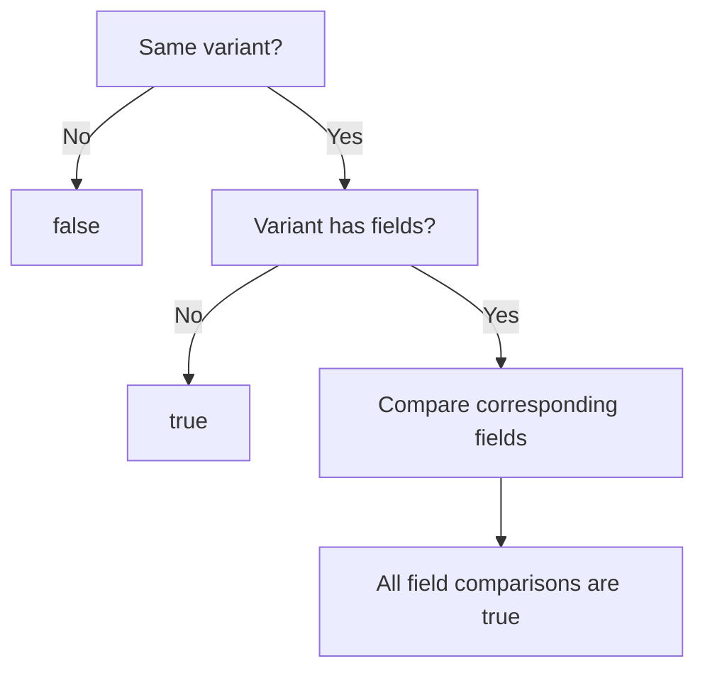
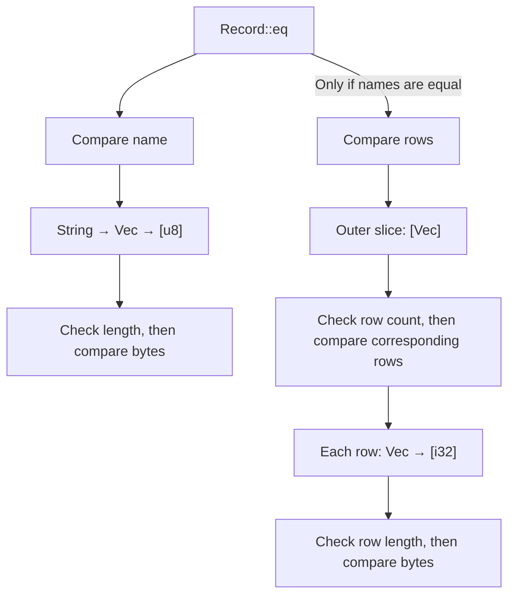

# `PartialEq` and `#[derive(PartialEq)]`: From Field Comparisons to Bytewise Equality

`PartialEq` powers Rust's `==` and `!=` operators. A comparison can involve several mechanisms: a derived implementation compares a type's immediate fields, those fields use their own implementations, and selected standard-library implementations use specialization to compare whole memory regions.

This article traces how equality comparisons proceed from a derived struct through the standard library to the bytewise fast paths used by slices and arrays.

## 1. The equality contract

For an overloaded comparison, the expression:

```rust
a == b
```

can be understood as:

```rust
PartialEq::eq(&a, &b)
```

The operator implicitly borrows its operands. Comparing two owned values does not, by itself, move them. Primitive comparisons have built-in compiler support, which we will return to in Section 3.

The essential interface is:

```rust
pub trait PartialEq<Rhs: ?Sized = Self> {
    fn eq(&self, other: &Rhs) -> bool;

    fn ne(&self, other: &Rhs) -> bool {
        !self.eq(other)
    }
}
```

`Rhs` defaults to `Self`, but a type can also implement comparisons with other types. For example, comparing `String` with `str` uses a different implementation from comparing `String` with `String`.

The methods must agree: `a != b` must have the same result as `!(a == b)`. The default `ne` provides this consistency.

Equality must also be symmetric and transitive whenever the necessary implementations exist:

| Property | Requirement | Implementations needed |
| --- | --- | --- |
| Symmetry | If `a == b`, then `b == a` | `A: PartialEq<B>` and `B: PartialEq<A>` |
| Transitivity | If `a == b` and `b == c`, then `a == c` | `A: PartialEq<B>`, `B: PartialEq<C>`, and `A: PartialEq<C>` |

Rust does not require those reverse or transitive comparison implementations to exist. The laws apply when they do exist. The compiler checks that implementations are well-typed; it does not prove these semantic laws. Violating them is a logic error, and unsafe code must not rely on their correctness for memory safety. See the [`PartialEq` contract](https://doc.rust-lang.org/std/cmp/trait.PartialEq.html).

`Eq` adds reflexivity: every value must compare equal to itself. Its essential interface is simply:

```rust
pub trait Eq: PartialEq {}
```

It adds no comparison algorithm. Floating-point types illustrate the distinction: a NaN does not compare equal to itself, so floating-point types implement `PartialEq` but not `Eq`.

Deriving `Eq` checks the required field bounds, but it still does not prove that the implementations obey the laws. The actual comparison remains the one supplied by `PartialEq`. See the [`Eq` documentation](https://doc.rust-lang.org/std/cmp/trait.Eq.html).

## 2. What derive generates

You can write an implementation directly:

```rust
struct Point {
    x: i32,
    y: i32,
}

impl PartialEq for Point {
    fn eq(&self, other: &Self) -> bool {
        self.x == other.x && self.y == other.y
    }
}
```

Or let the built-in derive macro generate the comparison:

```rust
#[derive(PartialEq)]
struct Point {
    x: i32,
    y: i32,
}
```

For this struct, the generated `eq` has the same field-comparison behavior as the handwritten version. The derived implementation uses the trait's default `ne`.

The central rule is:

> **Derive generates the comparison structure for the annotated type. Each immediate field is compared through that field type's own `PartialEq` implementation.**

For example:

```rust
#[derive(PartialEq)]
struct Inner {
    value: i32,
}

#[derive(PartialEq)]
struct Outer {
    inner: Inner,
    enabled: bool,
}
```

The relevant comparison for `Outer` is equivalent to:

```rust
impl PartialEq for Outer {
    fn eq(&self, other: &Self) -> bool {
        self.inner == other.inner && self.enabled == other.enabled
    }
}
```

Deriving `Outer` does not paste the body of `Inner::eq` into this method. `Inner` must already have a usable `PartialEq` implementation, whether derived or handwritten.

For generic types, derive also generates bounds. A basic example is:

```rust
#[derive(PartialEq)]
struct Wrapper<T> {
    value: T,
}
```

Here, the derived implementation requires `T: PartialEq`. For more complex field types, however, derive may impose stricter bounds than necessary. A handwritten implementation could sometimes use less restrictive bounds while performing the comparisons.

Generated implementations carry `#[automatically_derived]`, which lets tools and diagnostics recognize them. See the [Reference's description of derive](https://doc.rust-lang.org/reference/attributes/derive.html).

This discussion is only about how `==` compares two values. Constants used as patterns have an additional restriction: for structs and enums, `PartialEq` must be derived. A type with a handwritten `PartialEq` implementation is rejected as a constant pattern, even if its eq behaves exactly like the derived implementation, because constant patterns require structural equality rather than an arbitrary user-defined comparison.

See [constant patterns](https://doc.rust-lang.org/reference/patterns.html#constant-patterns).

## 3. Primitive values, enums, and references

### 3.1 Where primitive comparisons end

Consider:

```rust
let a: i32 = 1;
let b: i32 = 2;
let equal = a == b;
```

The compiler has a primitive integer comparison operation. It does not need to implement this operation by recursively calling the same trait method.

Nevertheless, `core` supplies `PartialEq` implementations for primitive types so that they also participate in trait-based and generic code. The integer implementation is essentially:

```rust
impl PartialEq for i32 {
    fn eq(&self, other: &Self) -> bool {
        *self == *other
    }
}
```

Inside this implementation, both operands are known to be integers. The `==` expression reaches the compiler's primitive comparison rather than calling back into the same method.

Thus `i32` provides both built-in equality and a trait interface to that equality. Generic code can require `T: PartialEq`, instantiate `T` with `i32`, and ultimately reach the primitive operation. The source-level method boundaries do not imply that the final machine code contains corresponding function calls. See the [primitive implementations in `core::cmp`](https://doc.rust-lang.org/nightly/src/core/cmp.rs.html).

### 3.2 Enum comparisons

For an enum, equality requires the same variant and equal fields within that variant:

```rust
#[derive(PartialEq)]
enum Shape {
    Circle(i32),
    Point,
}
```

A portable handwritten implementation with the same comparison behavior is:

```rust
impl PartialEq for Shape {
    fn eq(&self, other: &Self) -> bool {
        match (self, other) {
            (Shape::Circle(a), Shape::Circle(b)) => a == b,
            (Shape::Point, Shape::Point) => true,
            _ => false,
        }
    }
}
```

This implementation is an alternative to the derive above, not an additional implementation to place beside it.

The same logic can be organized as a discriminant check followed by payload comparisons. In that organization, different discriminants immediately produce `false`. Once equal discriminants have established that both values have the same variant, fieldless variants need no further comparison.

That explains why a generated body with a preceding discriminant check can use a final `_ => true` arm. Without that preceding check, the same wildcard would incorrectly accept different variants.



The diagram describes equality semantics. It does not require the compiler to emit a particular match expression or a separate physical discriminant load for every enum representation.

### 3.3 Why reference bindings compare the underlying values

In the `Circle` match arm, `a` and `b` are references to the payloads. Their comparison uses the standard library's forwarding implementation for references, conceptually:

```rust
impl<A: ?Sized, B: ?Sized> PartialEq<&B> for &A
where
    A: PartialEq<B>,
{
    fn eq(&self, other: &&B) -> bool {
        PartialEq::eq(*self, *other)
    }
}
```

Here `Self` is `&A`, so the method receives `&&A`. Dereferencing that argument once produces the `&A` required by the underlying comparison.

For the enum example, reference equality therefore reaches `i32` equality. Comparing references in this way compares the referenced values according to their `PartialEq` implementation; it does not test whether the references point to the same allocation. The standard library provides corresponding mutable-reference combinations as well. See the [reference implementations in `core::cmp`](https://doc.rust-lang.org/nightly/src/core/cmp.rs.html).

## 4. Slice equality and specialization

When a field comparison reaches a slice, derive has no slice algorithm to generate. The standard-library implementation handles it.

### 4.1 Check lengths, then delegate

The slice implementation is structured as follows:

```rust
impl<T, U> PartialEq<[U]> for [T]
where
    T: PartialEq<U>,
{
    fn eq(&self, other: &[U]) -> bool {
        let len = self.len();

        if len != other.len() {
            return false;
        }

        // SAFETY: Both pointers come from valid slices,
        // and both slices contain `len` elements.
        unsafe {
            SlicePartialEq::equal_same_length(
                self.as_ptr(),
                other.as_ptr(),
                len,
            )
        }
    }
}
```

`T: PartialEq<U>` permits the comparison even when the element types differ. Once the lengths match, the implementation delegates to an internal helper trait.

The actual source also includes const-trait syntax such as `const impl` and `T: [const] PartialEq<U>`. The latter expresses a conditional const requirement: ordinary use requires the ordinary trait implementation, while const use requires the corresponding const capability. The sketches here omit that machinery to focus on comparison strategy.

### 4.2 The generic fallback

`SlicePartialEq` provides the internal specialization point:

```rust
trait SlicePartialEq<B> {
    /// # Safety
    /// Both pointers must be readable for `len` elements.
    unsafe fn equal_same_length(
        lhs: *const Self,
        rhs: *const B,
        len: usize,
    ) -> bool;
}
```

Its generic implementation compares elements in sequence:

```rust
impl<A, B> SlicePartialEq<B> for A
where
    A: PartialEq<B>,
{
    default unsafe fn equal_same_length(
        lhs: *const Self,
        rhs: *const B,
        len: usize,
    ) -> bool {
        let mut idx = 0;

        while idx < len {
            // SAFETY: `idx < len`, and the caller guarantees
            // that both ranges are readable.
            if unsafe { *lhs.add(idx) != *rhs.add(idx) } {
                return false;
            }
            idx += 1;
        }

        true
    }
}
```

The loop stops at the first unequal pair. Notice that it calls `!=`, which is why the `eq`/`ne` consistency requirement matters.

The `default` method can be overridden by a more specific overlapping implementation. This uses specialization, an internal implementation mechanism that that is only available on nightly version.

The helper separates the shared length check from the choice of element-comparison strategy. It is how the standard library organizes this optimization; it should not be read as a general rule that all specialization requires a separate helper trait. See the [slice comparison source](https://doc.rust-lang.org/nightly/src/core/slice/cmp.rs.html).

### 4.3 The `BytewiseEq` contract

Some element types permit equality to be decided from their underlying bytes. The standard library marks selected implementations with the internal unsafe trait `BytewiseEq`:

```rust
// Simplified: this trait is internal to core.
unsafe trait BytewiseEq<Rhs = Self>: PartialEq<Rhs> + Sized {}
```

Its contract requires compatible layouts, no padding, no provenance in the values, and `eq`/`ne` behavior matching representation comparison. Implementing the trait is an unsafe assertion by the implementer, not a compiler-generated proof. The contract and concrete implementations are in the [`BytewiseEq` source](https://doc.rust-lang.org/src/core/cmp/bytewise.rs.html).

These conditions address both semantic correctness and the validity of reading the representation.

**Padding.** Equal field values do not imply equal padding bytes. Moreover, initialized fields do not imply initialized padding. A raw comparison can therefore violate the operation's safety requirements, rather than merely return an unexpected result. The `raw_eq` intrinsic explicitly rules out uninitialized bytes, including padding.

**Floating-point values.** `-0.0 == +0.0` is true despite their different representations. A NaN also compares unequal to itself even when its bytes are unchanged. Byte equality cannot reproduce those semantics.

**Provenance.** The consequences of provenance differ between compile-time and run-time byte comparison. During compile-time evaluation, `raw_eq` explicitly forbids provenance-bearing bytes: the evaluator has no native pointer representation whose address bytes it can simply inspect, yet `raw_eq` must still produce a definite `bool`. An `E0080` in such a case reflects this CTFE-specific requirement, not a general prohibition on inspecting pointer representations. At run time, a pointer has a concrete machine representation, so the same raw comparison is permitted and can produce a definite result.

This also shows that the provenance-free requirement is a conservative sufficient condition rather than a necessary condition for every possible run-time byte comparison. Even at run time, however, byte equality is not an identity test: two pointer values may have the same address representation while differing in provenance. `BytewiseEq` therefore requires more than merely being safely readable as bytes; it guarantees that representation equality agrees with `==`. Pointer types do not satisfy that stronger contract, which is why they do not carry the marker. This should not be confused with a claim that every run-time inspection of pointer representation is forbidden. See the [`raw_eq`](https://doc.rust-lang.org/nightly/std/intrinsics/fn.raw_eq.html)[ safety requirements](https://doc.rust-lang.org/nightly/std/intrinsics/fn.raw_eq.html).

The provenance restriction applies to the **values whose representations are being compared**, not to the pointers used to reach those values. Thus, the `lhs` and `rhs` pointers passed when comparing an ordinary integer slice may themselves carry provenance; what matters is that the slice elements being compared satisfy the `BytewiseEq` requirements.

### 4.4 Comparing the whole byte range

For marked element types, a more specific implementation replaces the element loop:

```rust
impl<A, B> SlicePartialEq<B> for A
where
    A: BytewiseEq<B>,
{
    unsafe fn equal_same_length(
        lhs: *const Self,
        rhs: *const B,
        len: usize,
    ) -> bool {
        // SAFETY: The readable element ranges imply a representable
        // byte size. BytewiseEq permits comparing those bytes.
        unsafe {
            let bytes = core::intrinsics::unchecked_mul(
                len,
                core::mem::size_of::<Self>(),
            );
            core::intrinsics::compare_bytes(
                lhs.cast::<u8>(),
                rhs.cast::<u8>(),
                bytes,
            ) == 0
        }
    }
}
```

`compare_bytes` compares the entire byte range and returns zero when the ranges match; the backend may lower it to a `memcmp`-style operation, although the exact generated code is not guaranteed. Slice length is value-dependent, while `SlicePartialEq` selection is determined statically by the element types.

Deriving `PartialEq` does not automatically provide `BytewiseEq`:

```rust
#[derive(PartialEq)]
#[repr(transparent)]
struct Id(u32);
```

Despite its simple representation and comparison semantics, `Id` has no standard-library `BytewiseEq` implementation, so its slice equality uses the generic fallback. The backend might still optimize that fallback later though.

## 5. Arrays and standard containers

Standard containers either provide their own specialization path or delegate equality to their contents, which may eventually reach slice equality.

### 5.1 Arrays have a separate specialization path

Array equality has its own specialization layer. For two arrays `[T; N]` and `[U; N]`, the `PartialEq` implementation delegates to an internal `SpecArrayEq` helper:

```rust
impl<T, U, const N: usize> PartialEq<[U; N]> for [T; N]
where
    T: PartialEq<U>,
{
    fn eq(&self, other: &[U; N]) -> bool {
        SpecArrayEq::spec_eq(self, other)
    }

    fn ne(&self, other: &[U; N]) -> bool {
        SpecArrayEq::spec_ne(self, other)
    }
}
```

`SpecArrayEq` then provides two implementations:

```rust
const trait SpecArrayEq<Other, const N: usize>: Sized {
    fn spec_eq(a: &[Self; N], b: &[Other; N]) -> bool;
    fn spec_ne(a: &[Self; N], b: &[Other; N]) -> bool;
}

// Generic fallback.
const impl<T: [const] PartialEq<Other>, Other, const N: usize>
    SpecArrayEq<Other, N> for T
{
    default fn spec_eq(a: &[Self; N], b: &[Other; N]) -> bool {
        a[..] == b[..]
    }

    default fn spec_ne(a: &[Self; N], b: &[Other; N]) -> bool {
        a[..] != b[..]
    }
}

// Bytewise specialization.
const impl<T: [const] BytewiseEq<U>, U, const N: usize>
    SpecArrayEq<U, N> for T
{
    fn spec_eq(a: &[T; N], b: &[U; N]) -> bool {
        unsafe {
            crate::intrinsics::raw_eq(
                a,
                crate::mem::transmute(b),
            )
        }
    }

    fn spec_ne(a: &[T; N], b: &[U; N]) -> bool {
        !Self::spec_eq(a, b)
    }
}
```

The selection is static specialization, not a runtime test:

```text
[T; N] == [U; N]
        |
        v
SpecArrayEq::spec_eq
        |
        +-- T: BytewiseEq<U>
        |       |
        |       v
        |    raw_eq(a, b)
        |
        `-- generic PartialEq only
                |
                v
             a[..] == b[..]
                |
                v
           slice equality
```

The generic implementation therefore reuses the slice machinery almost completely. Once

```rust
a[..] == b[..]
```

is reached, the arrays have been viewed as `&[T]` and `&[U]`, and the normal slice equality path takes over.

The specialized implementation avoids that path entirely. If the **element types** satisfy

```rust
T: BytewiseEq<U>
```

the entire arrays are compared directly with `raw_eq`.

The important distinction is that this specialization depends on the **element types**, not on the array types themselves implementing `BytewiseEq`. For example,

```rust
[u8; 9] == [u8; 9]
```

can use the `raw_eq` specialization because

```rust
u8: BytewiseEq<u8>
```

even if `[u8; 9]` itself is not marked `BytewiseEq`.

These are separate questions:

```text
Can [u8; 9] == [u8; 9] use the array fast path?
    -> requires u8: BytewiseEq<u8>
    -> yes

Is [u8; 9] itself BytewiseEq?
    -> separate marker implementation
    -> not necessarily
```

The second property matters when the array itself becomes an element of another container, for example `&[[u8; 9]]`.

Comparing the whole array at once is sound because arrays store their elements contiguously without padding between elements, while `BytewiseEq` guarantees that the element representations may safely be compared as bytes and that such comparison agrees with `PartialEq`.

Because `N` is a compile-time constant, the total array size is also statically known. The backend may therefore lower `raw_eq` to fixed-width integer or vector comparisons. Above a backend-dependent threshold, it may instead emit a `memcmp`-style operation. The exact generated code is not guaranteed.

### 5.2 `Vec<T>` forwards equality to slices

`Vec` does not introduce another bytewise specialization layer. The standard library uses the internal `__impl_slice_eq1!` macro to generate its equality implementations. For comparisons between two vectors, the macro expands to the following implementation, with stability attributes omitted:

```rust
const impl<T, U, A1: Allocator, A2: Allocator>
    PartialEq<Vec<U, A2>> for Vec<T, A1>
where
    T: [const] PartialEq<U>,
{
    #[inline]
    fn eq(&self, other: &Vec<U, A2>) -> bool {
        self[..] == other[..]
    }

    #[inline]
    fn ne(&self, other: &Vec<U, A2>) -> bool {
        self[..] != other[..]
    }
}
```

The two vectors may have different element types, `T` and `U`, provided that `T: PartialEq<U>`. They may also use different allocator types, `A1` and `A2`.

Both methods forward directly to slice comparison. The full-range indexing expressions `self[..]` and `other[..]` expose the elements without copying them. Slice equality then checks the lengths and uses either generic element comparison or the `BytewiseEq` specialization.

The same macro generates implementations for comparisons with slices and arrays. Even when the right-hand operand is an array, `other[..]` converts the comparison to slice equality, rather than using the array-specific `SpecArrayEq` path.

Only the elements in `0..len` participate in equality. Capacity, allocation address, and spare storage are not compared. Consequently, separately allocated vectors with different capacities can compare equal:

```rust
let mut a = Vec::with_capacity(4);
a.extend([1, 2, 3]);

let mut b = Vec::with_capacity(16);
b.extend([1, 2, 3]);

assert_eq!(a, b);
```

### 5.3 `String` reaches the same bytewise path through `Vec<u8>`

`String` stores its contents in a `Vec<u8>` and derives `PartialEq`:

```rust
#[derive(PartialEq, PartialOrd, Eq, Ord)]
pub struct String {
    vec: Vec<u8>,
}
```

The derived same-type equality therefore compares the `vec` field:

```text
String == String
       |
       v
Vec<u8> == Vec<u8>
       |
       v
[u8] == [u8]
       |
       v
u8: BytewiseEq<u8>
       |
       v
bytewise slice specialization
```

So `String` does not need a special `String`-specific byte comparison for `String == String`. Its representation naturally forwards the comparison through `Vec<u8>` to slice equality, where `u8` can use the bytewise fast path.

Separate `PartialEq` implementations handle comparisons involving `str`, `&str`, and related string types, but the same general principle applies: equality ultimately concerns the string contents, not allocation identity or spare capacity.

### 5.4 Other containers contribute their own equality semantics

Not every type simply exposes a contiguous byte sequence. Other standard types define equality according to their own semantic structure, and an enclosing `#[derive(PartialEq)]` simply invokes those implementations.

| Type or comparison | Equality semantics |
| --- | --- |
| `None == None` | `true` |
| `Some(a) == Some(b)` | compare `a` with `b` |
| `None == Some(_)` or the reverse | `false` |
| `Box<T>` | compare the contained `T` values |
| `&T` | forward comparison to the referenced values |

The general pattern is therefore:

```text
derived/container equality
        |
        v
equality semantics of each field or element
        |
        v
possibly another forwarding layer
        |
        v
slice/array specialization where applicable
        |
        v
generic PartialEq or bytewise comparison
```

`BytewiseEq` is therefore not a universal rule applied simply because a type looks simple in memory. It is an internal optimization contract used at specific specialization points. Arrays have their own `SpecArrayEq` path, while containers such as `Vec<T>` and `String` reach bytewise comparison indirectly by forwarding equality to their contents.

## 6. How nested comparisons compose

Consider a type with a string field and a nested vector:

```rust
#[derive(PartialEq)]
struct Record {
    name: String,
    rows: Vec<Vec<i32>>,
}
```

The derived implementation compares the fields in declaration order, stopping at the first mismatch. Its behavior is equivalent to:

```rust
impl PartialEq for Record {
    fn eq(&self, other: &Self) -> bool {
        self.name == other.name && self.rows == other.rows
    }
}
```

The `name` comparison delegates through `String`’s underlying `Vec<u8>` to slice equality over `u8`, which uses the bytewise specialization. If the names differ, the comparison returns `false` without comparing `rows`.

The `rows` comparison proceeds at two levels:

- **Outer level:** `Vec<Vec<i32>>` delegates to slice equality over `Vec<i32>`. After checking that the number of rows matches, it compares corresponding rows by calling `Vec<i32>`’s equality implementation, stopping at the first unequal row.
- **Inner level:** Each `Vec<i32>` delegates to slice equality over `i32`. After checking that the row lengths match, this comparison uses the bytewise specialization because `i32` implements `BytewiseEq`.

The outer level cannot use the same bytewise shortcut. Its elements are `Vec<i32>` objects, which contain a pointer, length, and capacity; the integers are stored in separate allocations. Comparing those objects’ bytes would compare their storage metadata rather than their integer contents. Two rows can contain the same integers despite having different allocation addresses or capacities.



This diagram describes how the equality implementations compose. It does not imply that every step remains a separate function call in the executable. Through [monomorphization](https://rustc-dev-guide.rust-lang.org/backend/monomorph.html), generic code is instantiated for concrete types; subsequent optimization may inline methods and remove intermediate operations.